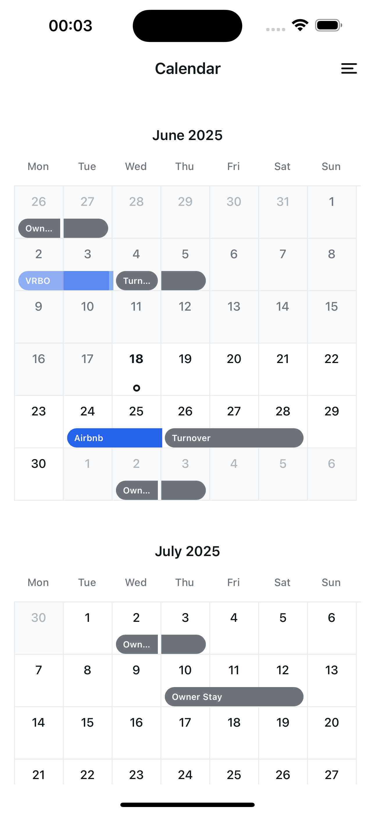

<div align="center">
  
  
  <h1 align="center">React Native Expo Bootstrap</h1>
  
  <p align="center">
    <strong>🚀 Production-Ready Mobile App Starter Kit</strong>
  </p>
  
  <p align="center">
    A carefully crafted React Native Expo bootstrap that combines the latest technologies with battle-tested components
  </p>
  
  <p align="center">
    <a href="#features">Features</a> •
    <a href="#why-these-libraries">Why These Libraries?</a> •
    <a href="#screenshots">Screenshots</a> •
    <a href="#getting-started">Getting Started</a> •
    <a href="#environment-variables">Environment Variables</a> •
    <a href="#tech-stack">Tech Stack</a> •
    <a href="#project-structure">Structure</a> •
    <a href="#contributing">Contributing</a>
  </p>
  
  <p align="center">
    
    
    
    
  </p>
</div>

---

## 👋 Hey There, Fellow Developer!

After 15 years in this wild ride we call software development, I've built my fair share of mobile apps. I've seen trends come and go, frameworks rise and fall, and "revolutionary" solutions that ended up being anything but. This bootstrap is the culmination of countless hours of trial, error, and "why the hell doesn't this work on Android?" moments.

**Why another React Native starter?** Because most of them are either too basic (hello, counter app) or too opinionated (do I really need Redux for a todo list?). This one sits right in that sweet spot - production-ready but not overwhelming, feature-rich but not bloated.

Every library here has earned its place through real-world battles. No trendy tech for the sake of it. Just solid, reliable tools that actually work cross-platform (yes, even on that one Android device your QA team loves to test on).

---

## 🎯 Why These Libraries?

Let me tell you why each of these made the cut after years of building apps that actually ship to stores:

### 📊 **[Victory Native XL](https://github.com/FormidableLabs/victory-native-xl)** - Charts That Actually Work
Remember the pain of trying to make charts work on both platforms? Victory Native XL uses Skia under the hood, which means buttery-smooth 60fps animations on both iOS and Android. I've tried them all - from [react-native-charts-wrapper](https://github.com/wuxudong/react-native-charts-wrapper) (native dependencies nightmare) to [react-native-svg-charts](https://github.com/JesperLekland/react-native-svg-charts) (performance issues with large datasets). Victory Native XL just works, and the gesture support is chef's kiss.

### 🎨 **[React Native Reanimated 3](https://docs.swmansion.com/react-native-reanimated/)** - Because Animations Matter
Your users might not consciously notice smooth animations, but they'll definitely notice janky ones. Reanimated 3 runs on the UI thread, which means your animations won't stutter when JavaScript is busy. The difference between 60fps and 30fps is the difference between "wow, this feels native" and "ugh, another React Native app."

### 🎭 **[Lottie React Native](https://github.com/lottie-react-native/lottie-react-native)** - Delightful Micro-interactions
After watching designers cry when their beautiful animations got butchered in implementation, Lottie was a game-changer. Export from After Effects, drop it in, done. No more "can you make it bounce a bit more?" conversations. Plus, the file sizes are tiny compared to GIFs or video.

### 🤏 **[React Native Gesture Handler](https://docs.swmansion.com/react-native-gesture-handler/)** - Touch Handling That Feels Native
The default React Native touch system has its limitations. Gesture Handler runs in the native thread and can handle complex gestures without dropping frames. That smooth drawer navigation? That's Gesture Handler doing its magic.

### 📱 **[React Native SVG](https://github.com/software-mansion/react-native-svg)** - Vector Graphics Done Right
Icons, illustrations, complex shapes - SVG handles them all while staying crisp on any screen density. No more @2x, @3x image variants. Just clean, scalable graphics that look perfect on everything from an iPhone SE to a tablet.

### 💾 **[Async Storage](https://react-native-async-storage.github.io/async-storage/)** - Simple Persistence That Works
Sometimes you just need to store some data locally. Async Storage is battle-tested, works everywhere, and doesn't require native linking headaches. For sensitive data, we've got Expo Secure Store, but for preferences, cache, and non-sensitive data? Async Storage is perfect.

### 🗺️ **[React Navigation 7.1.6](https://reactnavigation.org/)** - Navigation That Scales
I've tried them all - React Native Navigation, React Router Native, even rolled my own once (never again). React Navigation 7 with Expo Router gives you file-based routing that actually makes sense, deep linking that works, and TypeScript support that doesn't make you want to throw your laptop out the window.

### 🔒 **Version Locking Strategy**
All package versions are frozen (no ^ or ~ prefixes) for maximum stability. After dealing with "it worked yesterday" scenarios too many times, I decided predictability beats bleeding edge. You know exactly what you're getting, and your builds will be reproducible 6 months from now.

---

## ✨ Features

### 🎨 **Modern UI/UX Design**
Look, we've all built ugly apps. This isn't one of them. Every component has been crafted with attention to detail - from the floating tab bar that subtly bounces when you tap it, to the drawer that slides in with just the right amount of resistance. The responsive layouts actually work (tested on everything from iPhone 13 mini to iPad Pro), and the gesture support feels native because, well, it basically is.

### 🌓 **Dark Mode That Doesn't Suck**
You know what's worse than no dark mode? Bad dark mode. Every single component here has been tested in both themes. No more "oops, white text on white background" surprises. The theme switching is instant, persisted, and respects system preferences. Your users' retinas will thank you.

### 🔐 **Authentication That's Actually Flexible**
Here's the thing - not every app needs authentication from day one. That's why it's environment-controlled. Flip a switch, and you've got a full auth flow with form validation, secure storage, and beautiful transitions. Building a prototype? Leave it off. Ready for production? Turn it on. Simple.

### 📊 **Charts People Want to Touch**
Static charts are so 2010. These charts respond to gestures, show tooltips on touch, and animate beautifully. The bar chart selection feels satisfying, the line charts support multiple interpolation types (because sometimes you need that smooth curve), and the ring charts... well, they're just pretty.

### 📱 **Component Library From the Trenches**
Every component here exists because I needed it in a real project:
- **Buttons** that handle loading states properly (no more double-taps!)
- **Inputs** with validation that actually helps users
- **Modals** that don't break on Android keyboard appearance
- **Date Pickers** that work the same on both platforms (finally!)
- **Phone Input** that handles international formats without making you cry
- **PDF Viewer** because someone always wants to show terms and conditions

### 📅 **Calendar That Handles Real-World Complexity**
Not just another date picker. This calendar handles multi-day events, lazy loads for performance, and actually looks good. Built for booking systems, scheduling apps, or anywhere you need more than just picking a date.

### 🔔 **Push Notifications That Work**
Expo's push notification service just works. No more wrestling with FCM tokens, APNS certificates, or platform-specific code. The permission flow is user-friendly (because nobody likes aggressive permission requests), and there's even a test function so you can make sure everything's working.

### ⚡ **Performance First**
15 years taught me that performance isn't optional. Every list is optimized, every component is memoized where it matters, animations run at 60fps, and memory leaks are hunted down mercilessly. Your app will feel smooth even on that 3-year-old Android phone.

---

## 📱 Screenshots

### 🏠 Home Screen
<table width="100%">
  <tr>
    <td align="center"><strong>Light Mode</strong></td>
    <td align="center"><strong>Dark Mode</strong></td>
  </tr>
  <tr>
    <td></td>
    <td></td>
  </tr>
</table>

The home screen is your app's first impression. This one nails it with a clean layout, smooth animations, and just enough visual interest without being overwhelming. The pull-to-refresh actually feels good to use (thanks, Reanimated!).

### 📊 Charts Dashboard
<table width="100%">
  <tr>
    <td align="center"><strong>Light Mode</strong></td>
    <td align="center"><strong>Dark Mode</strong></td>
  </tr>
  <tr>
    <td></td>
    <td></td>
  </tr>
</table>

Interactive charts that make data exploration fun. Drag across the bar chart to see values, tap legend items to filter data, or switch between different chart types. All running at 60fps because Victory Native XL is just that good.

### 🎨 UI Components Showcase
<table width="100%">
  <tr>
    <td align="center"><strong>Light Mode</strong></td>
    <td align="center"><strong>Dark Mode</strong></td>
  </tr>
  <tr>
    <td></td>
    <td></td>
  </tr>
</table>

A living style guide of every component in the kit. This isn't just for show - it's actually useful during development. Need to see how a button looks in dark mode? Want to test modal behaviors? It's all here, interactive and theme-aware.

### 📅 Calendar View
<table width="100%">
  <tr>
    <td align="center"><strong>Light Mode</strong></td>
    <td align="center"><strong>Dark Mode</strong></td>
  </tr>
  <tr>
    <td></td>
    <td></td>
  </tr>
</table>

A calendar that handles real-world complexity. Multi-day events, color-coded statuses, and smooth month transitions. Built with performance in mind - even with hundreds of events, scrolling stays smooth.

### 👤 Profile Management
<table width="100%">
  <tr>
    <td align="center"><strong>Light Mode</strong></td>
    <td align="center"><strong>Dark Mode</strong></td>
  </tr>
  <tr>
    <td></td>
    <td></td>
  </tr>
</table>

Clean, functional, and to the point. Shows user info, account status, and quick actions. The sign-out flow is properly handled with loading states and error management.

### ⚙️ Settings
<table width="100%">
  <tr>
    <td align="center"><strong>Light Mode</strong></td>
    <td align="center"><strong>Dark Mode</strong></td>
  </tr>
  <tr>
    <td></td>
    <td></td>
  </tr>
</table>

Settings that actually make sense. Theme switching with live preview, notification preferences that respect user choice, and permission management that guides users to system settings when needed.

### 🔐 Authentication
<table width="100%">
  <tr>
    <td align="center"><strong>Light Mode</strong></td>
    <td align="center"><strong>Dark Mode</strong></td>
  </tr>
  <tr>
    <td></td>
    <td></td>
  </tr>
</table>

Authentication screens that don't feel like an afterthought. Smooth transitions between login and signup, proper keyboard handling (yes, even on Android), and form validation that helps rather than frustrates.

### 🍔 Navigation Drawer
<table width="100%">
  <tr>
    <td align="center"><strong>Light Mode</strong></td>
    <td align="center"><strong>Dark Mode</strong></td>
  </tr>
  <tr>
    <td></td>
    <td></td>
  </tr>
</table>

A custom drawer that feels native. Smooth gestures, proper backdrop handling, and a layout that works on all screen sizes. The theme toggle is right there for easy access.

---

## 🚀 Getting Started

### Prerequisites & Development Environment

#### 🖥️ Recommended Development Setup

After years of "why doesn't this build?" moments, here's the exact setup that works perfectly:

**Core Requirements:**
- **Node.js**: v24.1.0 (Latest LTS)
  - npm: v11.3.0
  - Why this version? Stability + all the latest features without the bleeding edge bugs
  
- **Java Development Kit (JDK)**: 17
  - Download from [Oracle JDK 17 Archive](https://www.oracle.com/java/technologies/javase/jdk17-archive-downloads.html)
  - Why JDK 17? It's the sweet spot for React Native - newer versions can cause gradle issues
  - Pro tip: Use the Oracle JDK, not OpenJDK, for fewer headaches

**This Project Uses (All Versions Frozen):**
- **Expo SDK**: 53.0.11 (Latest stable, locked)
- **React Native**: 0.79.3 (New Architecture ready!)
- **React**: 19.0.0 (Latest with concurrent features)
- **TypeScript**: 5.8.3 (Latest stable)
- **Expo CLI**: 0.24.14
- **React Native Reanimated**: 3.17.4
- **React Native Gesture Handler**: 2.24.0
- **React Native SVG**: 15.11.2
- **Victory Native**: 41.17.4
- **Lottie React Native**: 7.2.2

**Platform-Specific Tools:**
- **iOS Development** (Mac only):
  - Xcode 15+ (from App Store)
  - iOS Simulator
  - [CocoaPods](https://cocoapods.org/): `sudo gem install cocoapods`
  
- **Android Development**:
  - [Android Studio](https://developer.android.com/studio) (latest stable)
  - Android SDK Platform 34
  - Android SDK Build-Tools 34.0.0
  - Configure `ANDROID_HOME` in your shell profile

**Recommended IDE:**
- **VS Code** with these extensions:
  - [React Native Tools](https://marketplace.visualstudio.com/items?itemName=msjsdiag.vscode-react-native)
  - [ES7+ React/Redux/React-Native snippets](https://marketplace.visualstudio.com/items?itemName=dsznajder.es7-react-js-snippets)
  - [Prettier - Code formatter](https://marketplace.visualstudio.com/items?itemName=esbenp.prettier-vscode)
  - [ESLint](https://marketplace.visualstudio.com/items?itemName=dbaeumer.vscode-eslint)

#### 🔧 Quick Environment Check

Run this to verify your setup:
```bash
# Check Node version
node --version  # Should be v24.1.0

# Check npm version  
npm --version   # Should be 11.3.0

# Check Java version
java --version  # Should show 17.x.x

# Check Expo CLI
npx expo --version  # Should be 0.24.14
```

If any of these are wrong, you're gonna have a bad time. Trust me.

### Installation

1. **Clone this bad boy**
   ```bash
   git clone https://github.com/petrushin-ai/react-native-expo-bootstrap.git
   cd react-native-expo-bootstrap
   ```

2. **Install dependencies**
   ```bash
   npm install
   # or if you're a yarn person
   yarn install
   ```

3. **Set up your environment**
   ```bash
   cp env.example .env
   ```
   
   Edit `.env` to your liking:
   ```env
   EXPO_PUBLIC_AUTH_ENABLED=false  # Set to true when you're ready
   EXPO_PUBLIC_API_URL=https://your-api-url.com
   ```

4. **Fire it up**
   ```bash
   npx expo start
   ```

5. **See it in action**
   - Press `i` for iOS simulator
   - Press `a` for Android emulator
   - Scan the QR code with Expo Go for the real deal

### Building for Production

When you're ready to ship (exciting times!):

```bash
# iOS - Time to deal with Apple
eas build --platform ios

# Android - The wild west
eas build --platform android

# Both - Because why not
eas build --platform all
```

Pro tip: Set up your app.json properly first. Trust me on this one.

---

## 🔧 Environment Variables

Let me break down each environment variable and why you might need it. After years of debugging "it works on my machine" issues, proper environment configuration is your best friend.

### 📝 Complete Environment Variables Reference

```env
# Expo Configuration
EXPO_PROJECT_ID=your-project-id

# API Configuration
EXPO_PUBLIC_API_URL=https://your-api-url.com

# Authentication Settings
EXPO_PUBLIC_AUTH_ENABLED=false
EXPO_PUBLIC_AUTH_USERNAME=admin
EXPO_PUBLIC_AUTH_PASSWORD=password123

# Permission Settings
EXPO_PUBLIC_PERMISSIONS_NOTIFICATIONS=true
EXPO_PUBLIC_PERMISSIONS_LOCATION=true
EXPO_PUBLIC_PERMISSIONS_DEBUG=false
```

### 🔑 Variable Explanations

#### **EXPO_PROJECT_ID**
Your unique Expo project identifier. You'll get this when you create a project on expo.dev. Required for EAS builds and updates.
- **Required for**: Production builds, OTA updates
- **Example**: `4a6dfaa-ada5-4d0g-9jdh7`

#### **EXPO_PUBLIC_API_URL**
The base URL for your API endpoints. Change this between development, staging, and production environments.
- **Default**: None (you'll need to set this)
- **Usage**: All API calls will use this as the base URL
- **Pro tip**: Use ngrok for local development with real devices

#### **EXPO_PUBLIC_AUTH_ENABLED**
The master switch for authentication. Perfect for building prototypes without auth, then enabling it when you're ready.
- **Values**: `true` | `false`
- **Default**: `false`
- **What it controls**: 
  - Shows/hides sign-in screen
  - Enables/disables protected routes
  - Manages session persistence

#### **EXPO_PUBLIC_AUTH_USERNAME** & **EXPO_PUBLIC_AUTH_PASSWORD**
Demo credentials for development. Obviously, don't use these in production - they're just for quick testing.
- **Default**: `admin` / `password123`
- **Usage**: Only when `AUTH_ENABLED=true`
- **Note**: Replace with real auth service in production

#### **EXPO_PUBLIC_PERMISSIONS_NOTIFICATIONS**
Controls whether the app requests notification permissions on startup.
- **Values**: `true` | `false`
- **Default**: `true`
- **Why disable?**: Some apps don't need notifications initially

#### **EXPO_PUBLIC_PERMISSIONS_LOCATION**
Controls whether the app requests location permissions.
- **Values**: `true` | `false`
- **Default**: `true`
- **Why disable?**: Not all apps need location services

#### **EXPO_PUBLIC_PERMISSIONS_DEBUG**
Shows permission configuration UI and reset options. Incredibly useful during development.
- **Values**: `true` | `false`
- **Default**: `false`
- **What it shows**: 
  - Current permission status
  - Reset permissions button
  - Permission configuration details

### 🚀 Environment-Specific Configurations

Here's how I typically set these up for different environments:

**Development (.env.development)**
```env
EXPO_PUBLIC_API_URL=http://localhost:3000
EXPO_PUBLIC_AUTH_ENABLED=false
EXPO_PUBLIC_PERMISSIONS_DEBUG=true
```

**Staging (.env.staging)**
```env
EXPO_PUBLIC_API_URL=https://api-staging.yourapp.com
EXPO_PUBLIC_AUTH_ENABLED=true
EXPO_PUBLIC_PERMISSIONS_DEBUG=false
```

**Production (.env.production)**
```env
EXPO_PUBLIC_API_URL=https://api.yourapp.com
EXPO_PUBLIC_AUTH_ENABLED=true
EXPO_PUBLIC_PERMISSIONS_DEBUG=false
```

### 💡 Pro Tips

1. **Never commit `.env` files** - That's what `.env.example` is for
2. **Use `EXPO_PUBLIC_` prefix** - Expo only exposes variables with this prefix to your app
3. **Keep secrets server-side** - These variables are bundled with your app, so don't put sensitive data here
4. **Use EAS Secrets** for production - For sensitive values, use `eas secret:create` instead

---

## 🛠️ Tech Stack Deep Dive

### Core Technologies
- **[React Native 0.79.3](https://reactnative.dev/)** - The latest and greatest with New Architecture support. We're living in the future!
- **[React 19.0.0](https://react.dev/)** - The newest React with all the performance improvements and better concurrent features.
- **[Expo SDK 53.0.11](https://expo.dev/)** - The latest SDK with all the new features and improvements. Development has never been smoother.
- **[TypeScript 5.8.3](https://www.typescriptlang.org/)** - Latest TypeScript with even better type inference and performance.
- **[Expo Router 5.1.0](https://expo.github.io/router/docs/)** - File-based routing that makes sense. Deep linking included.

### UI & Animation Libraries
- **[React Native Reanimated 3.17.4](https://docs.swmansion.com/react-native-reanimated/)** - Smooth 60fps animations that run on the UI thread
- **[React Native Gesture Handler 2.24.0](https://docs.swmansion.com/react-native-gesture-handler/)** - Touch handling that feels native
- **[Victory Native 41.17.4](https://github.com/FormidableLabs/victory-native-xl)** - Performant, interactive charts with Skia
- **[Lottie React Native 7.2.2](https://github.com/lottie-react-native/lottie-react-native)** - After Effects animations in your app
- **[React Native SVG 15.11.2](https://github.com/software-mansion/react-native-svg)** - Crisp vector graphics at any size
- **[React Native Skia 2.0.4](https://shopify.github.io/react-native-skia/)** - High-performance 2D graphics powered by Google's Skia

### State & Storage
- **React Context API** - Sometimes you don't need Redux. This is one of those times.
- **[Async Storage 2.1.2](https://react-native-async-storage.github.io/async-storage/)** - Simple key-value storage that works
- **[Expo Secure Store 14.2.3](https://docs.expo.dev/versions/latest/sdk/securestore/)** - For when you need to store sensitive data

### Development Tools
- **[ESLint 9.25.0](https://eslint.org/)** - Catches bugs before they happen
- **[Prettier](https://prettier.io/)** - Because arguing about formatting is pointless
- **[Babel Core 7.25.2](https://babeljs.io/)** - JavaScript transpiler that just works
- **[Expo Dev Client](https://docs.expo.dev/develop/development-builds/introduction/)** - Custom development builds when you need them

---

## 📁 Project Structure

Here's how everything is organized (and why):

```
react-native-expo/
├── app/                    # Expo Router magic happens here
│   ├── (protected)/       # Routes that need auth (when enabled)
│   │   ├── (tabs)/       # Tab navigation screens
│   │   └── calendar.tsx  # Standalone calendar screen
│   ├── _layout.tsx       # Root layout with providers
│   ├── index.tsx         # Entry point redirect logic
│   └── sign-in.tsx       # Auth screen (when needed)
├── components/            # Reusable components (the good stuff)
│   ├── charts/           # Victory Native XL chart components
│   ├── layout/           # Layout wrappers and containers
│   └── ui/               # UI primitives and compounds
├── constants/            # App-wide constants
├── contexts/             # React contexts for global state
├── hooks/                # Custom hooks (use these!)
├── types/                # TypeScript types and interfaces
├── utils/                # Helper functions
└── assets/               # Images, fonts, Lottie files
```

Each folder has a purpose, and nothing is there "just in case." If you don't need it, delete it. Keep it clean.

---

## 🤝 Contributing

Found a bug? Have an idea? Want to add a feature? Awesome! Here's how:

1. Fork the repository
2. Create your feature branch (`git checkout -b feature/something-awesome`)
3. Commit your changes (`git commit -m 'Add something awesome'`)
4. Push to the branch (`git push origin feature/something-awesome`)
5. Open a Pull Request

Just remember: keep it simple, test on both platforms, and document what you did. Future you will thank present you.

---

## 💭 Final Thoughts

After 15 years of building mobile apps, I've learned that the best code is the code you don't have to write. This bootstrap gives you a solid foundation without the bloat. Every component is customizable, every library is replaceable, and every decision is documented.

Use it as a starting point, not a bible. Your app has unique needs, and this bootstrap is designed to adapt to them. Rip out what you don't need, extend what you do, and ship something awesome.

Remember: perfect is the enemy of shipped. This bootstrap helps you ship faster without sacrificing quality.

---

## 📄 License

This project is licensed under the MIT License - see the [LICENSE](LICENSE) file for details. Use it, modify it, sell it - just build something cool.

---

## 👏 Credits

<div align="center">
  <p>Built with ❤️, ☕, and probably too much Stack Overflow by</p>
  
  <a href="https://t.me/wedigital">
    
  </a>
  
  <a href="https://github.com/petrushin-ai">
    
  </a>
  
  <a href="mailto:petrushin.a@live.ru">
    
  </a>
</div>

---

<div align="center">
  <p>If this saved you some time, consider giving it a ⭐️</p>
  <p>Now go build something awesome! 🚀</p>
</div>
